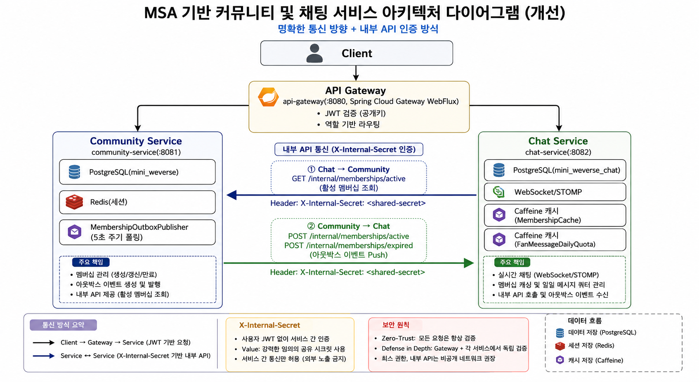

# mini_weverse

> **서비스 간 데이터 정합성과 접근 제어를 해결하는 MSA 기반 팬 커뮤니티 아키텍처**

mini_weverse는 커뮤니티·멤버십·실시간 채팅이 독립된 서비스로 분리된 위버스(Weverse) 클론 플랫폼입니다. 팔로우·멤버십·역할(Role) 등 여러 축의 접근 제어가 게시글 열람권부터 채팅 메시지 가시성, WebSocket 접속 권한까지 서비스 경계를 넘나들며 실시간으로 갈리는 구조로, 트랜잭션 아웃박스와 낙관적 락, DB 유니크 제약을 통해 서비스 간 상태 동기화와 동시성 경합을 제어하고, 비대칭키(RS256) JWT로 발급자와 검증자 사이의 인증 신뢰 경계를 분리하여 실제 운영 가능한 수준의 백엔드 시스템을 지향합니다.

---

## 1. 프로젝트 개요

### 1.1 프로젝트 개요

**전체 기간**
2026-06-29 ~ 2026-07-24

**플랫폼 핵심 가치**
- 구독 상태에 따른 접근 권한을 서비스 경계를 넘어 정확하게 동기화
- 위버스 DM 방식의 실시간 팬-아티스트 소통 경험 제공

**아키텍처 지향점**
- 서비스별 독립 배포·확장이 가능한 MSA 구조 확립 (공통 모듈은 진짜 중복 코드만 공유)
- 다중 인스턴스로의 수평 확장(scale-out)을 전제로 한 설계

**주요 타겟 지표**
- 멤버십 상태 변경 이벤트의 무유실 전달(트랜잭션 아웃박스) 보장
- 동시 요청 상황에서도 중복 구독 기간·중복 처리 방지 (DB 유니크 제약, 낙관적 락)

**서비스 간 통신**


### 1.2 기술스택

| 구분 | 스택 |
|---|---|
| 언어/런타임 | Java 21, Spring Boot 4.1.0 |
| 빌드 | Gradle (멀티모듈: `common`, `community-service`, `chat-service`, `api-gateway`) |
| API 게이트웨이 | Spring Cloud Gateway (WebFlux, `spring-cloud-starter-gateway-server-webflux`) |
| 웹/API | Spring Web MVC, Spring Validation |
| 인증/인가 | Spring Security, JWT (jjwt 0.13.0, RS256 비대칭키), Spring Session + Redis (세션), OAuth2 Client(카카오 로그인) |
| 채팅 | Spring WebSocket + STOMP, Caffeine(로컬 캐시), Jsoup(XSS 방지 sanitize) |
| 데이터 | Spring Data JPA, PostgreSQL, `schema.sql` 기반 부분/유니크 인덱스 |
| 인프라 | Docker, GitHub Actions(CD, 현재 community-service만) |

**스택 선정 이유**
- **Spring Cloud Gateway (WebFlux)**: 모든 트래픽이 지나는 지점이라, 요청마다 스레드를 점유하지 않는 논블로킹 방식이 적합해서 선택했습니다.
- **JWT RS256(비대칭키)**: 발급자(community-service)와 검증자(게이트웨이·chat-service)의 책임을 분리하기 위함입니다. 대칭키였다면 검증하는 서비스도 발급 가능한 키를 들고 있어야 해서 이 분리가 안 됩니다.
- **Redis(세션)**: refresh 토큰을 서버가 직접 통제(회전/무효화)해야 해서, 클라이언트에만 맡기지 않고 세션 저장소로 채택했습니다.

### 1.3 ERD

서비스마다 별도 DB를 쓰고 있어 두 DB 사이에는 FK가 없습니다 (참조는 애플리케이션 레벨의 ID 값 복제/이벤트 전파로만 이뤄집니다).

**community-service DB**

```
┌─ 회원 / 아티스트 ────────────────────────────────────────────┐
│ USER 1:1 ARTIST_PROFILE   (본인이 아티스트인 경우에만)        │
│ ARTIST_PROFILE N:1 ARTIST_PROFILE   (group_id, MEMBER→GROUP) │
└────────────────────────────────────────────────────────────┘

┌─ 팔로우 ────────────────────────────────────────────────────┐
│ USER 1:N FOLLOW N:1 ARTIST_PROFILE                          │
│  (FOLLOW는 JPA 엔티티 아님 — JdbcTemplate 네이티브 쿼리)      │
└────────────────────────────────────────────────────────────┘

┌─ 멤버십 ────────────────────────────────────────────────────┐
│ USER 1:N MEMBERSHIP N:1 ARTIST_PROFILE                      │
│ MEMBERSHIP 1:N MEMBERSHIP_PERIOD   (실제 구독 유지 기간 이력) │
│ MEMBERSHIP 1:N MEMBERSHIP_OUTBOX_EVENT   (chat-service 발행) │
└────────────────────────────────────────────────────────────┘

┌─ 게시글 / 댓글 ──────────────────────────────────────────────┐
│ USER 1:N POST                                               │
│ ARTIST_PROFILE 1:N POST                                     │
│ POST 1:N COMMENT                                             │
│ USER 1:N COMMENT                                             │
└────────────────────────────────────────────────────────────┘
```

- `FOLLOW`는 JPA 엔티티가 아니라 순수 도메인 객체 + `JdbcTemplate` 네이티브 쿼리로 다루는 테이블입니다 (팔로우 관계는 생성/삭제/존재확인 외에 별도 상태 변화가 없어 JPA 영속성 관리가 필요 없다고 판단).
- `MEMBERSHIP_PERIOD`는 "실제로 구독 중이었던 기간"의 이력입니다. 그냥 연장(공백 없는 갱신)은 기존 기간을 이어가고, 재구독(공백 있는 갱신)은 새 기간을 엽니다 — chat-service가 메시지 가시성을 판단하는 근거로 이 이력을 그대로 복제해 씁니다.

**chat-service DB**

```
┌─ 채팅 (community-service와 별도 DB, FK 없음) ─────────────────┐
│ CHAT_ROOM 1:N CHAT_MESSAGE                                   │
│ MEMBERSHIP_PERIOD  (community-service 이력의 로컬 복제본)     │
└────────────────────────────────────────────────────────────┘
```

- `MEMBERSHIP_PERIOD`는 community-service의 동명 테이블과 스키마는 비슷하지만 **별도 테이블**입니다. community-service가 멤버십 상태를 바꿀 때마다(구독/취소/만료) 아웃박스로 이 서비스에 push한 이력을 그대로 복제해둔 것으로, FK나 실시간 조회 없이 채팅 메시지 조회 시점에 "그 시점에 구독 중이었는지"를 로컬 DB만으로 판단하기 위한 구조입니다.

### 1.4 아키텍처



- **공유 시크릿 인증**: 내부 API(`/internal/**`)는 사용자 JWT가 없는 서버-서버 호출이라 게이트웨이의 역할 기반 인가와 무관합니다. 대신 `InternalServiceAuthFilter`가 두 서비스 모두에서 공유 시크릿 헤더를 검증합니다.
- **아웃박스 패턴**: 멤버십 상태 변경(구독/만료)과 같은 트랜잭션 안에서 이벤트를 DB에 적재해두고, 별도 스케줄러가 5초마다 폴링해 chat-service로 전달합니다. chat-service가 그 순간 응답하지 않거나 community-service가 재시작해도 이벤트가 유실되지 않습니다.
- **컨테이너 배포는 아직 community-service 1개뿐**입니다 (`docker-compose.yml`에는 postgres/redis만, 앱 Dockerfile은 루트에 community-service 전용으로 1개만 존재). chat-service·api-gateway는 로컬 JVM 실행만 검증된 상태입니다. → 2번째 README에서 3개 서비스 모두 컨테이너화합니다.

---

## 2. 주요 기능 및 비즈니스 정책

### 2.1 주요 서비스

| 서비스 | 역할 요약 |
|---|---|
| API Gateway | JWT 검증, 역할 기반 라우팅 |
| Community Service | 회원 인증, 팔로우, 멤버십(구독), 게시글·댓글 |
| Chat Service | 멤버십 기반 실시간 채팅(WebSocket/STOMP), 메시지 가시성 필터링 |

### 2.2 API 게이트웨이

| 기능 | 설명 |
|---|---|
| 라우팅 | `/api/chat/ws-chat` → chat WS, `/api/chat/**` → chat REST, 그 외 전부 → community-service |
| JWT 검증 | `common` 모듈의 `JwtVerifier`(공개키)로 게이트웨이 자체가 먼저 검증 |
| 역할 기반 인가 | `RoleAuthorizationGlobalFilter`가 JWT의 role 클레임으로 경로별 접근 제한 |

**정책 → 기술 선택**
- **게이트웨이를 신뢰하지 않고 각 서비스도 JWT를 재검증한다.** 게이트웨이의 인가는 "라우팅 단계에서 걸러주는 1차 방어"일 뿐, 각 서비스가 스스로도 검증해야 게이트웨이 설정 실수나 우회 요청에도 안전합니다(defense in depth). 그래서 `JwtVerifier`(검증 전용, 공개키만 가짐)를 `common` 모듈에 두고 3개 서비스가 각자 독립적으로 검증하되, **발급은 community-service만** 개인키로 하도록 비대칭키(RS256)를 택했습니다 — 대칭키였다면 검증하는 서비스도 발급 가능한 키를 들고 있어야 해서 이 책임 분리가 안 됩니다.
- **WebSocket 핸드셰이크도 같은 `JwtVerifier`로 검증합니다.** REST와 WS가 검증 로직이 갈리면 한쪽만 고쳐서 우회 가능한 구멍이 생기기 쉬워, 검증 자체는 공통 컴포넌트로 통일하고 REST 필터/WS 핸드셰이크 인터셉터라는 진입점만 따로 뒀습니다.

### 2.3 커뮤니티 서비스

**팬-아티스트 커뮤니티**
아티스트를 팔로우하고, 아티스트/팬 게시판에 글과 댓글을 남기는 기본적인 SNS 기능입니다.

**구독형 멤버십**
아티스트를 월 단위로 구독(멤버십)하면 멤버십 전용 게시글과 아티스트와의 1:1 채팅에 접근할 수 있습니다. 구독 여부가 여러 기능의 접근 권한을 가르는 핵심 축입니다.

| 기능 | 엔드포인트 |
|---|---|
| 회원가입/로그인/로그아웃/토큰 재발급 | `POST /signup`, `/login`, `/logout`, `/reissue` |
| 회원 탈퇴/프로필 조회 | `DELETE /users/me`, `GET /users/{userId}` |
| 아티스트 검색/프로필 조회 | `GET /artists`, `GET /artists/{artistId}` |
| 팔로우/언팔로우/팔로우 목록 | `GET·POST /follows`, `DELETE /follows/{artistId}` |
| 멤버십 구독/취소/내 멤버십 조회 | `GET·POST /memberships`, `POST /memberships/{id}/cancel` |
| 게시글 CRUD (피드/아티스트 게시판) | `GET·POST /artists/{artistId}/posts`, `GET·PATCH·DELETE /posts/{postId}`, `GET /users/{userId}/posts` |
| 댓글 CRUD | `POST·GET /posts/{postId}/comments`, `PATCH·DELETE /comments/{commentId}`, `GET /users/{userId}/comments` |
| (내부) 멤버십 활성 여부 조회 | `GET /internal/memberships/active` |

**정책 → 기술 선택**
- **인증 토큰은 access(JWT)/refresh(서버 세션·쿠키) 분리.** access token은 클라이언트가 들고 다니며 매 요청 검증하고, refresh는 탈취 시 즉시 무효화할 수 있어야 해서 쿠키+서버 저장(Redis) 방식을 씁니다. Redis를 세션 저장소로 쓰는 이유도 이 refresh 토큰 회전(rotation)을 서버가 통제하기 위함입니다.
- **회원/아티스트 프로필/게시글/댓글은 모두 소프트 삭제.** 탈퇴한 유저의 글이 다른 유저의 댓글·팔로우·멤버십 이력과 얽혀 있어 하드 삭제 시 FK 제약이 깨지거나 이력이 통째로 사라집니다. `@SQLRestriction("deleted_at IS NULL")` + `@NotFound(action = IGNORE)` 조합으로, 삭제된 참조는 예외 대신 null로 취급하도록 해서 "글은 남고 작성자 표시만 사라지는" 자연스러운 동작을 코드 곳곳에서 반복하지 않게 했습니다.
- **멤버십 만료는 실시간이 아니라 자정 배치.** `MembershipExpirationScheduler`가 매일 00:00에 만료 대상을 한 번에 처리합니다. 결제 연동이 없는 MVP 특성상 "정확히 만료 시각에" 끊을 필요는 없고, 배치 방식이 훨씬 단순하고 부하도 예측 가능합니다. 대신 배치와 유저의 갱신 요청이 같은 순간 충돌할 수 있어(같은 row를 배치가 만료시키려는 순간 유저가 갱신) `@Version` 낙관적 락으로 배치 쪽이 조용히 건너뛰게 했습니다.
- **멤버십 변경 알림은 동기 호출이 아니라 트랜잭션 아웃박스.** 구독/만료 처리 자체는 community-service DB 트랜잭션이고, chat-service에게 알려주는 건 별도 서비스로의 네트워크 호출입니다. 이 둘을 하나의 트랜잭션으로 묶을 수 없어서(분산 트랜잭션 없이), "상태 변경 커밋 + 이벤트 적재"까지만 원자적으로 보장하고 실제 전송은 스케줄러가 폴링하며 재시도하게 분리했습니다 — chat-service가 그 순간 다운되어도 이벤트가 유실되지 않습니다.

### 2.4 채팅 서비스

**실시간 채팅**
멤버십을 가진 팬만 아티스트와 채팅할 수 있는 위버스 DM 방식의 WebSocket 채팅입니다. 아티스트 메시지는 방 전체에 방송되고, 팬 메시지는 본인과 아티스트에게만 보입니다.

| 기능 | 엔드포인트 |
|---|---|
| 내 메시지 조회 (팬 기준, 구독 기간 필터 적용) | `GET /api/chat/rooms/{artistId}/messages` |
| 아티스트 인박스 조회 (필터 없이 전체) | `GET /api/chat/rooms/{artistId}/inbox` |
| 팬 메시지 전송 | STOMP `SEND /app/rooms/{artistId}/fan-message` |
| 아티스트 메시지 전송(방송) | STOMP `SEND /app/rooms/{artistId}/artist-message` |
| (내부) 멤버십 활성/만료 push 수신 | `POST /internal/memberships/active`, `/internal/memberships/expired` |

**정책 → 기술 선택**
- **위버스 DM 방식 가시성.** 아티스트 메시지는 방을 구독 중인 모두에게 방송(`/topic/rooms/{artistId}/broadcast`), 팬 메시지는 보낸 본인 + 아티스트에게만(`/queue/rooms/{artistId}`, `/queue/rooms/{artistId}/inbox`) 전달합니다. 팬별로 메시지를 복제 저장하지 않고 STOMP의 topic/개인 큐 라우팅만으로 가시성을 나눠서, 저장 구조는 단순한 1개 테이블(`chat_messages`)로 유지했습니다.
- **메시지 조회 시 가시성은 구독 "기간 이력" 기준.** 팬이 지금은 멤버십이 없어도 과거 구독 기간에 주고받은 메시지는 계속 보여야 하고, 반대로 지금 활성이어도 구독 전에 오간(방송) 메시지까지 보여선 안 됩니다. 그래서 단순히 "지금 활성 회원인가"가 아니라 `MembershipPeriod` 이력과 메시지 시각을 대조하는 쿼리(`findVisibleMessages`)로 판단합니다.
- **하루 팬 메시지 5건 제한.** `FanMessageDailyQuota`(Caffeine)로 팬이 한 아티스트에게 보낼 수 있는 메시지 수를 하루 5건으로 제한 — 실제 위버스의 "하트 유사 상호작용" 정책을 단순화해 반영한 것으로, 소수의 팬 메시지가 아티스트 인박스를 도배하는 걸 막습니다.
- **멤버십 확인은 매번 원격 호출하지 않고 로컬 캐시(Caffeine) + 실패 시 fail-safe.** WS로 메시지를 보낼 때마다 community-service에 동기 호출하면 채팅 지연이 원격 호출 왕복시간에 그대로 종속됩니다. 그래서 `MembershipCache`(자정 만료)로 활성 여부를 캐싱하고, community-service가 상태를 바꿀 때 `markActive`/`markExpired` push로 캐시를 즉시 정정합니다. 단, community-service 호출 자체가 실패한 경우(네트워크 오류 등)는 `Optional.empty()`로 구분해 **캐시하지 않고** 그 요청만 실패 처리합니다 — 일시 장애를 "비활성"으로 캐시에 굳혀버리면 진짜 활성 회원이 자정까지 계속 차단될 수 있기 때문입니다.
- **멤버십 활성화/만료 push의 중복 수신은 DB 제약으로 방어.** 아웃박스는 최소 1번 전달(at-least-once)을 보장하는 대신 같은 이벤트가 두 번 올 수 있습니다. "먼저 확인하고 없으면 저장"은 두 요청이 거의 동시에 오면 둘 다 확인을 통과해버리는 경합이 있어서, 대신 **바로 저장을 시도하고 실패를 잡는** 방식(`DataIntegrityViolationException` catch)을 쓰고, 이걸 실제로 막아주는 건 애플리케이션 로직이 아니라 DB의 부분 유니크 인덱스(`uk_membership_periods_open`, 같은 팬-아티스트 조합에 "열린" 기간은 하나만)입니다.

---

## 3. 테스트 및 성능 검증

### Caffeine 로컬 캐시의 인스턴스 한계 재현 테스트

Docker로 3개 컨테이너를 분리하고 Redis로 전환하기 전에, 지금 구조(Caffeine 로컬 캐시)가 다중 인스턴스에서 실제로 깨지는지부터 직접 재현했습니다.

**방법**
- chat-service를 포트만 다르게(8082, 8083) 두 번 띄웠습니다. 두 인스턴스는 같은 DB를 보지만, `FanMessageDailyQuota`(하루 팬 메시지 5건 제한)는 Caffeine 기반이라 JVM 메모리에만 있어서 서로 공유되지 않습니다.
- 같은 팬 계정으로 8082에 메시지 5개를 보내 하루 한도를 채운 뒤, 같은 계정으로 8083에 메시지 5개를 더 보냈습니다.

**결과**

| 시나리오 | 전송 | 서버가 받아들인 메시지 |
|---|---|---|
| 8082에 5개 전송 | 5건 | 5건 (정상: 한도 정확히 채움) |
| 8082에 1개 더 전송 (6번째) | 1건 | 0건 (정상: 한도 초과로 거부) |
| 8083에 5개 전송 (같은 계정, 같은 날) | 5건 | 5건 (**문제**: 이미 하루 5건을 다 쓴 계정인데 또 통과됨) |

DB에서 실제 저장된 메시지 수를 확인한 결과, 같은 팬이 하루에 보낸 메시지가 **10건**이었습니다(의도한 한도는 5건).

**의미**: 인스턴스 하나만 있을 땐 한도가 정확히 작동하지만, 인스턴스가 늘어나는 순간 "인스턴스 수 × 5건"까지 뚫립니다. `MembershipCache`(멤버십 활성 여부 캐시)도 동일한 구조라 같은 문제가 있습니다. → 이 문제는 Docker 3개 분리 + Redis 전환(2번째 README)으로 해결합니다.

---

## 4. 프로젝트 한계점 및 개선 방향

**한계점**
- **컨테이너화가 community-service 1개뿐**: chat-service, api-gateway는 아직 Dockerfile/이미지가 없어 배포 단위로 검증되지 않았습니다.
- **`MembershipCache`, `FanMessageDailyQuota`가 인스턴스 로컬(Caffeine) 캐시**: 로드맵상 ALB+ASG로 chat-service를 다중 인스턴스로 스케일아웃할 계획이 있는데, 지금 구조로는 인스턴스마다 캐시가 따로 놀아 "A 인스턴스에서 활성 확인됨"이 "B 인스턴스에서는 모름"으로 어긋날 수 있고, 하루 메시지 제한도 인스턴스별로 따로 카운트되어 실제로는 5건이 아니라 (인스턴스 수 × 5)건까지 보낼 수 있게 됩니다.
- **아웃박스 push가 단일 인스턴스를 전제로 함**: chat-service가 여러 인스턴스로 늘어나면 `markActive`/`markExpired` push가 그중 한 인스턴스에만 도달해, 나머지 인스턴스는 캐시가 자정까지 정정되지 않는 문제가 이론적으로 존재합니다(아직 실측/재현은 안 됨).
- **모니터링/부하테스트 부재**: 현재 어느 시점에 병목이 생기는지, 스케일아웃이 실제로 필요한 트래픽 수준이 어느 정도인지 측정된 데이터가 없습니다.

**개선 방향**
- 2번째 README: Docker 3개 분리 + Redis 전환으로 캐시/카운터의 인스턴스 로컬 문제를 해결합니다.
- 3번째 README: 모니터링을 붙여 실제 병목 지점을 데이터로 확인하고, 스케일아웃이 필요한 트래픽 수준을 측정합니다.
- 4번째 README: 그 결과로 드러난 추가 개선 사항을 정리합니다.
