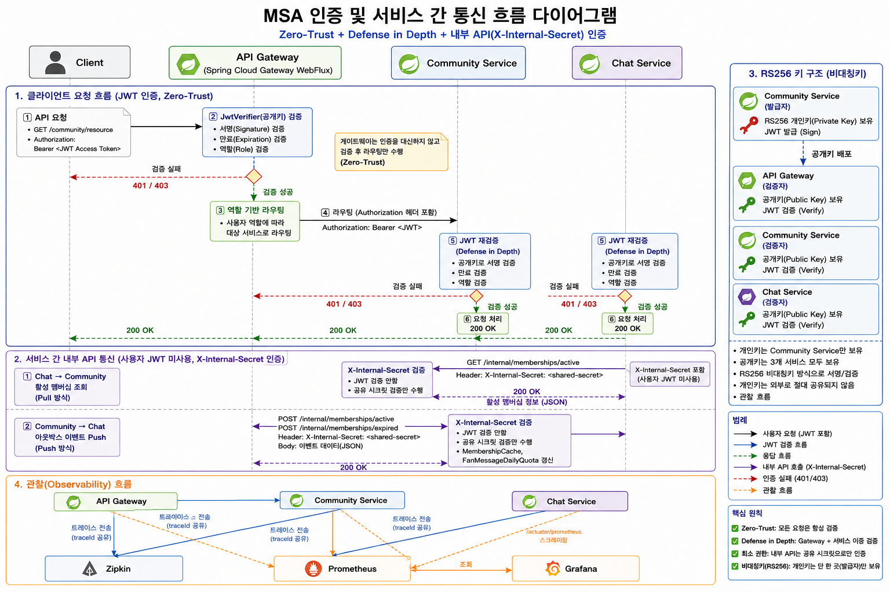

# 🥨 mini_weverse

> **"서비스 간 데이터 정합성과 접근 제어를 해결하는 MSA 기반 팬 커뮤니티 아키텍처"**

mini_weverse는 커뮤니티·멤버십·실시간 채팅이 독립된 서비스로 분리된 위버스(Weverse) 클론 플랫폼. 팔로우·멤버십·역할(Role) 등 여러 축의 접근 제어가 게시글 열람권부터 채팅 메시지 가시성, WebSocket 접속 권한까지 서비스 경계를 넘나들며 실시간으로 갈리는 구조로, 트랜잭션 아웃박스와 낙관적 락, DB 유니크 제약을 통해 서비스 간 상태 동기화와 동시성 경합을 제어. 비대칭키(RS256) JWT로 발급자와 검증자 사이의 인증 신뢰 경계를 분리해 실제 운영 가능한 수준의 백엔드 시스템을 지향

---

## 📅 1. 프로젝트 개요

### 🚀 1.1 프로젝트 개요

**전체 기간**
2026-06-29 ~ 2026-07-24

**플랫폼 핵심 가치**
- 구독 상태에 따른 접근 권한을 서비스 경계를 넘어 정확하게 동기화
- 위버스 DM 방식의 실시간 팬-아티스트 소통 경험 제공

**아키텍처 지향점**
- 서비스별 독립 배포·확장이 가능한 MSA 구조 확립 (공통 모듈은 진짜 중복 코드만 공유)
- 다중 인스턴스로의 수평 확장(scale-out)을 전제로 한 설계

**주요 타겟 지표**
- 멤버십 상태 변경 이벤트의 무유실 전달(트랜잭션 아웃박스) 보장
- 동시 요청 상황에서도 중복 구독 기간·중복 처리 방지 (DB 유니크 제약, 낙관적 락)

### 🛠️ 1.2 기술스택

| 구분 | 스택 |
|---|---|
| 언어/런타임 | Java 21, Spring Boot 4.1.0 |
| 빌드 | Gradle (멀티모듈: `common`, `community-service`, `chat-service`, `api-gateway`) |
| API 게이트웨이 | Spring Cloud Gateway (WebFlux, `spring-cloud-starter-gateway-server-webflux`) |
| 웹/API | Spring Web MVC, Spring Validation |
| 인증/인가 | Spring Security, JWT (jjwt 0.13.0, RS256 비대칭키), Spring Session + Redis (세션), OAuth2 Client(카카오 로그인) |
| 채팅 | Spring WebSocket + STOMP, Redis(멤버십 캐시·일일 메시지 카운터), Jsoup(XSS 방지 sanitize) |
| 데이터 | Spring Data JPA, PostgreSQL, `schema.sql` 기반 부분/유니크 인덱스 |
| 모니터링 | Zipkin(분산 트레이싱), Prometheus(메트릭 수집), Grafana(시각화), Micrometer |
| 인프라 | Docker(3개 서비스 전체 컨테이너화), GitHub Actions(CD, 3개 서비스 전체 빌드) |

**스택 선정 이유**
- **Spring Cloud Gateway (WebFlux)**: 모든 트래픽이 지나는 지점이라 요청마다 스레드를 점유하지 않는 논블로킹 방식이 적합해서 선택
- **JWT RS256(비대칭키)**: 발급자(community-service)와 검증자(게이트웨이·chat-service)의 책임 분리 목적. 대칭키였다면 검증하는 서비스도 발급 가능한 키를 들고 있어야 해서 이 분리가 불가능
- **WebSocket + STOMP**: 순수 WebSocket만 쓰면 "이 메시지를 어느 클라이언트들에게 보낼지" 라우팅을 직접 구현해야 함. STOMP는 destination(topic) 기반 pub/sub을 기본 제공해서 채팅방 단위 구독·브로드캐스트를 프로토콜 레벨에서 바로 쓸 수 있어 채택

### 🗄️ 1.3 ERD

**community-service DB**

<code>FOLLOW</code> — PK 설계 (Long PK vs 복합키 vs Entity 제외)

**기술**: Follow는 수정(update)이 없고, 다른 엔티티가 FK로 참조하지도 않고, 객체 동일성/더티체킹 같은 JPA 기능이 전혀 필요 없는 순수 조인 테이블. Entity 없이 INSERT/DELETE/조회를 `JdbcTemplate` 네이티브 쿼리로 직접 처리하고, PK는 DDL에서 (follower_id, artist_id) 복합키로 직접 지정

**트레이드오프**

| 옵션 | 설명 | 인덱스 | 보일러플레이트 | 단점의 성격 |
|---|---|---|---|---|
| Long PK 유지 | `Long id` PK + (follower_id, artist_id) unique constraint | 2개 | 없음 | 영구적(작지만 계속) |
| JPA 복합키 | `@EmbeddedId FollowId` + `Persistable` | 1개 | 많음(FollowId 클래스, equals/hashCode, Persistable) | 영구적(코드에 계속 남음), 실질 이득 없음 |
| **Follow를 JPA 엔티티에서 제외 (선택)** | Entity 없이 INSERT/DELETE/조회를 직접 쿼리로 | 1개 | 없음 | 일회성(패턴이 다르다는 이해 비용) |

**선택 이유**: 위 세 옵션 모두 DB 레벨 무결성 보장은 동일하고 복합키의 성능 이점(MySQL 클러스터드 인덱스 근거)은 PostgreSQL(힙 저장 구조)에 적용되지 않아 실질 이득이 없음. 코드에 영구히 남는 보일러플레이트가 없는 3번을 선택

<code>MEMBERSHIP_PERIOD</code> — 활성 여부만 볼지, 기간 이력까지 남길지

**기술**: `MEMBERSHIP`(현재 상태)과 별도로 "실제로 구독 중이었던 기간"을 기록하는 `MEMBERSHIP_PERIOD` 이력 테이블

**트레이드오프**

| 기술 | 장점 | 단점 |
|---|---|---|
| 지금 활성 구독자인지만 확인 | 구현 단순(boolean 캐시 하나로 충분) | 공백 있는 재구독 시, 구독 안 하던 기간에 온 방송 메시지까지 전부 다시 보임 |
| **구독 기간 이력을 별도로 남기고 확인 (선택)** | 실제 구독하지 않았던 기간의 메시지는 재구독해도 안 보임 | 기간 이력 테이블 신설, 조회 쿼리가 복잡해짐, 서비스 간 push 페이로드에 시각 정보 추가 필요 |

**선택 이유**: "구독한 기간만큼만 대화가 보인다"는 요구사항 자체가 정밀한 기간 추적을 요구해서, 현재 상태만 담는 `MEMBERSHIP`만으로는 부족

**chat-service DB**

<code>MEMBERSHIP_PERIOD</code> — 실시간 조회 vs 로컬 복제

**기술**: community-service와 스키마는 비슷하지만 별도 테이블. community-service가 멤버십 상태를 바꿀 때마다(구독/취소/만료) 아웃박스로 push한 이력을 그대로 복제해서 저장

**트레이드오프**

| 방식 | 장점 | 단점 |
|---|---|---|
| 실시간 조회 (매 메시지 조회마다 community-service API 호출) | 구현 단순, 데이터 중복 없음 | 조회마다 네트워크 왕복 발생, community-service 장애 시 채팅 조회까지 같이 막힘 |
| **로컬 복제 (아웃박스 push를 받아 저장, 선택)** | 조회가 로컬 DB만으로 끝나 빠르고, community-service 장애와 분리됨 | 같은 성격의 데이터가 두 서비스 DB에 중복 저장되고, 복제 시점 사이 짧은 지연(eventual consistency) 가능 |

**선택 이유**: 메시지 조회는 채팅 서비스의 핵심 경로라, 매번 원격 호출에 의존하면 지연과 장애 전파 위험이 커서 로컬 복제로 조회 경로를 독립시킴

### 🏗 1.4 아키텍처

**왜 MSA로 나눴는지**
- **Chat Service를 별도 서비스로 분리**: 채팅은 트래픽 패턴상 스케일 아웃이 잦을 것으로 예상돼, Community Service와 묶여있으면 채팅 부하 때문에 커뮤니티 기능까지 같이 늘려야 하는 낭비가 생김. 독립시켜서 채팅만 따로 확장 가능하게 함
- **로그인/인증은 Community Service에 포함**: 별도 인증 서버로 분리할 만큼 부담이 큰 기능이 아니라고 판단해, Community Service 안에 그대로 둠
- **알림 서버 추가 예정**: 채팅에 대한 알림 기능을 준비 중인데, 채팅서버가 스케일 아웃될수록 알림 발송량도 같이 늘어나는 구조라 이것도 별도 서비스로 분리할 계획
- **다중 서버 구조라 Zipkin 도입**: 서비스가 여러 개로 나뉘면서 요청 하나가 어디서 느려지는지 한 서비스 로그만 봐서는 알 수 없어져서, 분산 트레이싱(Zipkin)으로 병목 지점을 서비스 경계 너머까지 추적

**서비스 간 연결 구조**
- **infrastructure**: User는 API Gateway로만 접근, Gateway가 Community Service·Chat Service로 라우팅. Community Service ↔ Chat Service는 Gateway를 거치지 않고 Internal API로 직접 통신
- **infrastructure ↔ 공유 DB**: Community Service는 community DB, Chat Service는 Chat DB를 각자 독립적으로 사용(FK 없음). Redis는 두 서비스가 캐시 용도로 각각 독립적으로 접근(두 DB 사이를 잇는 구조 아님)
- **infrastructure ↔ monitoring**: API Gateway, Community Service, Chat Service는 각자 독립적으로 자기 트레이스를 Zipkin에 전송(push). 반대로 Prometheus는 이 3개 서비스의 `/actuator/prometheus` 엔드포인트를 하나씩 따로 찾아가 메트릭을 가져옴(pull, 스크레이핑) — 서비스마다 개별로 주고받는 구조라 어느 서비스가 부하 걸렸는지 서비스 단위로 구분 가능
- **monitoring**: Grafana가 Prometheus·Zipkin 양쪽에 조회(query). 메트릭 그래프에서 스파이크가 찍힌 지점(exemplar)을 클릭하면 그 순간의 Zipkin 트레이스로 바로 이동해 원인 확인 가능

---

## 🔑 2. 주요 기능 및 비즈니스 정책

### 📡 2.1 서비스 간 통신

### 🔐 2.2 API Gateway

게이트웨이 + 서비스 이중 JWT 검증 (defense in depth)

**주요기능 설명**: 게이트웨이가 `JwtVerifier`(공개키)로 먼저 검증 후 역할 기반 라우팅. 이후 각 서비스도 같은 `JwtVerifier`로 한 번 더 검증

**트레이드오프**

| 방식 | 장점 | 단점 |
|---|---|---|
| 게이트웨이만 검증 | 검증 로직이 한 곳에만 있어 단순 | 게이트웨이 설정 실수나 우회 요청이 들어오면 각 서비스가 무방비 |
| **게이트웨이 + 각 서비스 이중 검증 (선택)** | 게이트웨이가 뚫려도 각 서비스가 스스로 방어(defense in depth) | 검증 로직이 여러 곳에 존재(단, `common` 모듈로 통일해 중복 코드는 아님) |

**선택 이유**: 게이트웨이의 인가는 "라우팅 단계에서 걸러주는 1차 방어"일 뿐이라, 각 서비스가 스스로도 검증해야 안전하다고 판단. 발급은 community-service만 개인키로 하도록 RS256(비대칭키)을 채택해, 검증 서비스들은 공개키만 가지고도 이중검증이 가능하게 함

WebSocket 핸드셰이크 검증 통일

**주요기능 설명**: REST 필터와 WS 핸드셰이크 인터셉터, 진입점은 다르지만 검증 로직 자체는 동일한 `JwtVerifier` 사용

**트레이드오프**

| 방식 | 장점 | 단점 |
|---|---|---|
| REST/WS 각각 별도 검증 로직 | 각 진입점에 맞춰 자유롭게 구현 | 한쪽만 고치고 다른 쪽을 놓치면 우회 가능한 구멍 발생 |
| **공통 컴포넌트로 검증 로직 통일 (선택)** | 검증 규칙이 한 곳에서만 관리돼 우회 경로 생길 여지가 적음 | 진입점(필터/인터셉터)마다 연결하는 코드는 별도로 필요 |

**선택 이유**: 검증 로직이 갈리면 한쪽만 고쳐서 생기는 우회 구멍이 생기기 쉬워, 검증 자체는 공통 컴포넌트로 통일하고 진입점만 따로 둠

### 🖥️ 2.3 Community Service

인증 토큰 관리 (Access/Refresh 분리 + RT Rotation)

**주요기능 설명**: 일반 유저(`/api/**`)는 access(JWT)/refresh(서버 세션·Redis) 분리 + RT Rotation. **관리자(`/admin/**`)는 이와 별도로 완전히 Session 인증** — `SecurityConfig`에 필터체인 자체가 `adminFilterChain`/`apiFilterChain`으로 분리되어 있어, 관리자는 JWT를 아예 쓰지 않고 세션 쿠키로만 인증

**트레이드오프**

| 기술 | 장점 | 단점 | 적용 대상 |
|---|---|---|---|
| **JWT(Stateless, 일반 유저 선택)** | 서버가 상태를 안 가져 확장에 유리, MSA 구조에 적합 | 로그아웃/강제만료 처리가 번거로움(RT 저장소 필요) | `/api/**` |
| **Session(Stateful, 관리자 선택)** | 서버에서 즉시 무효화 가능, 구현 단순 | 서버가 상태를 들고 있어야 해서 확장 시 세션 클러스터링 필요 | `/admin/**` |
| RT 재사용(갱신해도 기존 RT 유지) | 구현 단순 | RT가 탈취되면 만료 전까지 계속 악용 가능 | - |
| **RT Rotation(갱신 시 새 RT 발급, 선택)** | 탈취된 RT가 한 번 쓰이면 무효화되어 피해 범위 축소 | 멀티 디바이스 동시 갱신 시 race condition 가능(멀티 디바이스 미지원이라 리스크로 수용) | `/api/**` |

**선택 이유**: 일반 유저는 트래픽이 많고 향후 확장을 고려해 stateless한 JWT를 선택. 반대로 관리자는 소수이고 즉각적인 권한 회수(강제 로그아웃)가 확장성보다 더 중요해 Session을 선택 — 그래서 하나의 방식으로 통일하지 않고 역할별로 필터체인 자체를 분리함. 일반 유저 쪽은 탈취 시 피해를 최소화하기 위해 RT도 재사용이 아닌 Rotation 방식을 채택

회원/게시글/댓글 소프트 삭제

**주요기능 설명**: 탈퇴/삭제 시 실제로 행을 지우지 않고 `deletedAt`만 채움. `@SQLRestriction("deleted_at IS NULL")` + `@NotFound(action = IGNORE)`로 조회에서 자동 제외

**트레이드오프**

| 기술 | 장점 | 단점 |
|---|---|---|
| Hard Delete | 구현 단순, 저장 공간 절약 | 게시글·댓글 등 연관 데이터 관리 어렵고 복구 불가, FK 제약 위반 위험 |
| **Soft Delete (선택)** | 데이터 복구 가능, 연관 데이터(댓글·팔로우·멤버십 이력) 유지 가능 | 조회 시 삭제 여부를 항상 고려해야 함 |

**선택 이유**: 탈퇴한 유저의 글이 다른 유저의 댓글·팔로우·멤버십 이력과 얽혀 있어, 하드 삭제 시 FK 제약이 깨지거나 이력이 통째로 사라짐. "글은 남고 작성자 표시만 사라지는" 자연스러운 동작을 위해 소프트 삭제 채택

멤버십 만료 처리 (실시간 vs 배치)

**주요기능 설명**: `MembershipExpirationScheduler`가 매일 자정(00:00)에 만료 대상을 한 번에 처리. 배치와 유저의 갱신 요청이 겹치면 낙관적 락(`@Version`)으로 배치 쪽이 조용히 건너뜀

**트레이드오프**

| 기술 | 장점 | 단점 |
|---|---|---|
| 조회 시점 실시간 계산 | 배치 없이 항상 최신 상태 반영 | 매 조회마다 계산 비용, 다른 로직에서도 매번 재계산 필요 |
| **배치 스케줄러로 주기적 일괄 전환 (선택)** | status 컬럼이 항상 최신값으로 유지되어 다른 로직은 단순 조회만 하면 됨 | 배치 주기(하루 1회) 동안 실제 만료와 반영 사이 지연 가능 |

**선택 이유**: 멤버십 만료는 실시간성이 크리티컬하지 않다고 판단(결제 연동 없는 MVP 특성상 "정확히 만료 시각에" 끊을 필요 없음). 배치 방식이 훨씬 단순하고 부하도 예측 가능

멤버십 변경 알림 (동기 호출 vs 트랜잭션 아웃박스)

**주요기능 설명**: 구독/만료 처리(DB 트랜잭션)와 chat-service 알림(네트워크 호출)을 분리 — "상태 변경 커밋 + 이벤트 적재"까지만 원자적으로 보장하고, 실제 전송은 스케줄러가 5초마다 폴링하며 재시도

**트레이드오프**

| 방식 | 장점 | 단점 |
|---|---|---|
| 동기 호출(상태 변경 트랜잭션 안에서 바로 chat-service 호출) | 구현 단순, 실시간 반영 | chat-service가 그 순간 응답 안 하면 트랜잭션 전체 실패, 분산 트랜잭션 없이는 두 작업을 하나로 묶을 수 없음 |
| **트랜잭션 아웃박스 (선택)** | chat-service 장애/다운타임과 무관하게 이벤트 유실 없음 | 아웃박스 테이블·발행자·폴링 로직 추가 필요, 즉시 반영은 아니고 최대 폴링 주기(5초)만큼 지연 |

**선택 이유**: 향후 서비스를 더 쪼개고 메시지 브로커(Kafka 등) 도입 계획이 있어서, 지금 아웃박스 테이블을 만들어두면 나중에 발행 소스만 REST 호출에서 브로커 발행으로 바꾸면 되고 쓰기 경로(트랜잭션 안에서 이벤트 적재)는 그대로 유지됨

### 💬 2.4 Chat Service

위버스 DM 방식 메시지 가시성

**주요기능 설명**: 아티스트 메시지는 방을 구독 중인 모두에게 방송(`/topic/rooms/{artistId}/broadcast`), 팬 메시지는 보낸 본인 + 아티스트에게만(`/queue/...`) 전달

**트레이드오프**

| 방식 | 장점 | 단점 |
|---|---|---|
| 팬별로 메시지 복제 저장 | 조회 쿼리가 단순해짐(본인 것만 필터 없이 조회) | 팬 수만큼 저장 공간 낭비, 아티스트 메시지 하나가 팬 수만큼 복제됨 |
| **STOMP topic/개인 큐 라우팅만으로 가시성 분리 (선택)** | 저장 구조가 단순한 1개 테이블(`chat_messages`)로 유지됨 | 조회 시 가시성 판단 로직이 쿼리에 들어가야 함 |

**선택 이유**: 메시지를 팬별로 복제 저장하지 않고 STOMP의 라우팅 기능만으로 가시성을 나눠서, 저장 구조를 단순하게 유지

메시지 조회 가시성 판단 기준

**주요기능 설명**: 단순히 "지금 활성 회원인가"가 아니라 `MembershipPeriod` 기간 이력과 메시지 시각을 대조하는 쿼리(`findVisibleMessages`)로 판단

**트레이드오프**

| 기술 | 장점 | 단점 |
|---|---|---|
| 지금 활성 구독자인지만 확인 | 구현 단순(boolean 캐시 하나로 충분) | 공백 있는 재구독 시, 구독 안 하던 기간에 온 방송 메시지까지 전부 다시 보임 |
| **구독 기간 이력 대조 (선택)** | 실제 구독하지 않았던 기간의 메시지는 재구독해도 안 보임 | 조회 쿼리가 EXISTS 서브쿼리로 복잡해짐, 서비스 간 push 페이로드에 시각 정보 추가 필요 |

**선택 이유**: "구독한 기간만큼만 대화가 보인다"는 요구사항 자체가 정밀한 기간 추적을 요구해서 후자를 선택 (ERD `MEMBERSHIP_PERIOD`와 동일한 판단 기준)

하루 팬 메시지 5건 제한

**주요기능 설명**: `FanMessageDailyQuota`(Redis 원자적 INCR)로 팬이 한 아티스트에게 보낼 수 있는 메시지 수를 하루 5건으로 제한. 카운터가 이번 요청으로 처음 생긴 경우(count == 1)에만 자정 만료를 설정 — 매 요청마다 TTL을 다시 세팅하면 "마지막 메시지 시각 + 하루"로 만료 시점이 계속 밀려서 자정 초기화가 안 됨

**트레이드오프**

| 방식 | 장점 | 단점 |
|---|---|---|
| 무제한 | 구현 불필요, 팬 자유도 높음 | 소수의 팬 메시지가 아티스트 인박스를 도배할 위험 |
| 로컬 카운터(Caffeine) | 구현 단순, 조회 빠름 | chat-service가 다중 인스턴스로 늘어나면 인스턴스마다 카운터가 따로 놀아 실제로는 (인스턴스 수 × 5)건까지 통과됨(재현 테스트로 확인된 문제) |
| **Redis 원자적 INCR (선택)** | 인스턴스가 몇 개든 카운터를 공유해 정확히 5건으로 제한됨 | Redis 네트워크 홉이 로컬 카운터보다 추가됨 |

**선택 이유**: 실제 위버스의 "하트 유사 상호작용" 정책을 단순화해 반영한 제한이지만, chat-service를 다중 인스턴스로 스케일 아웃할 계획이 있어 인스턴스 간 공유가 안 되는 로컬 카운터로는 제한이 무의미해짐 — Redis의 원자적 INCR로 전환해 인스턴스 수와 무관하게 정확한 카운팅 보장

멤버십 확인 방식 (원격 호출 vs 캐시)

**주요기능 설명**: `MembershipCache`(Redis, 자정 만료)로 활성 여부를 캐싱. community-service와 같은 Redis 서버를 쓰되 DB index로 분리(chat-service: 1, community-service: 0)해 키가 안 섞이게 함. community-service가 상태를 바꿀 때 `markActive`/`markExpired` push로 캐시를 즉시 정정. Redis 조회/저장이 실패하면 예외를 던지지 않고 캐시 미스로 간주해 원격 확인으로 폴백(fail-safe)

**트레이드오프**

| 방식 | 장점 | 단점 |
|---|---|---|
| 매번 community-service에 동기 호출 | 항상 최신 상태, 캐시 관리 불필요 | 채팅 지연이 원격 호출 왕복시간에 그대로 종속 |
| 로컬 캐시(Caffeine) | 조회가 가장 빠름(네트워크 홉 없음) | chat-service가 다중 인스턴스로 늘어나면 "A 인스턴스에서 활성 확인됨"이 "B 인스턴스에서는 모름"으로 어긋남(재현 테스트로 확인된 문제) |
| **Redis 공유 캐시 (선택)** | 인스턴스가 몇 개든 같은 상태를 공유해 일관성 유지 | 로컬 캐시보다는 느리고, Redis 자체 장애 가능성을 별도로 처리해야 함 |

**선택 이유**: WS로 메시지를 보낼 때마다 community-service에 동기 호출하면 채팅 지연이 커져서 캐싱이 필요했지만, 로컬 캐시(Caffeine)는 다중 인스턴스 스케일 아웃 계획과 정면으로 충돌해 Redis 공유 캐시로 전환. 단, community-service 호출 자체가 실패한 경우는 캐시하지 않고 그 요청만 실패 처리 — 일시 장애를 "비활성"으로 캐시에 굳혀버리면 진짜 활성 회원이 자정까지 계속 차단될 수 있기 때문

멤버십 push 중복 수신 방어

**주요기능 설명**: 아웃박스는 최소 1번 전달(at-least-once)이라 같은 이벤트가 두 번 올 수 있음. "바로 저장 시도 후 실패를 잡는" 방식(`DataIntegrityViolationException` catch)과 DB 부분 유니크 인덱스(`uk_membership_periods_open`)로 이중 방어

**트레이드오프**

| 방식 | 장점 | 단점 |
|---|---|---|
| 먼저 확인하고 없으면 저장 | 구현이 직관적 | 두 요청이 거의 동시에 오면 둘 다 확인을 통과해버리는 경합 발생 |
| **바로 저장 시도 + 실패 캐치 + DB 유니크 인덱스 (선택)** | 동시 요청에도 DB가 최종 방어선이 되어 중복이 원천 차단됨 | 제약 위반 예외를 의미있는 처리로 변환하는 코드 추가 필요 |

**선택 이유**: 애플리케이션 로직만으로는 동시 요청 경합을 완전히 막을 수 없어서, DB의 부분 유니크 인덱스(같은 팬-아티스트 조합에 "열린" 기간은 하나만)를 실질적인 최종 방어선으로 둠

---

## 🧪 3. 테스트 및 성능 검증

---

## 🚧 4. 프로젝트 한계점 및 개선 방향

**한계점**
- 부하테스트 미실시 — 실제 병목 지점이 어디인지, 스케일아웃이 필요한 트래픽 수준이 어느 정도인지 측정된 데이터 없음

**개선 방향**
- **API Gateway에 Eureka(서비스 디스커버리) 도입 예정**: 지금은 각 서비스 주소를 게이트웨이 설정에 직접 매핑해두는 구조라, 스케일 아웃할 때마다(인스턴스가 늘 때마다) 주소를 수동으로 관리해야 함. Eureka를 붙이면 인스턴스가 늘어나도 자동으로 등록/탐색되게 할 계획
- **알림 서버 추가 예정**: 채팅에 대한 알림을 별도 서비스로 분리 — 채팅서버가 스케일 아웃되는 만큼 알림 발송량도 같이 늘어나는 구조라, 채팅 서버 확장과 독립적으로 알림만 따로 확장 가능하게 할 계획

---

## 🔗 외부 문서

- API 명세서: (링크 추가 예정)
- 노션: (링크 추가 예정)
